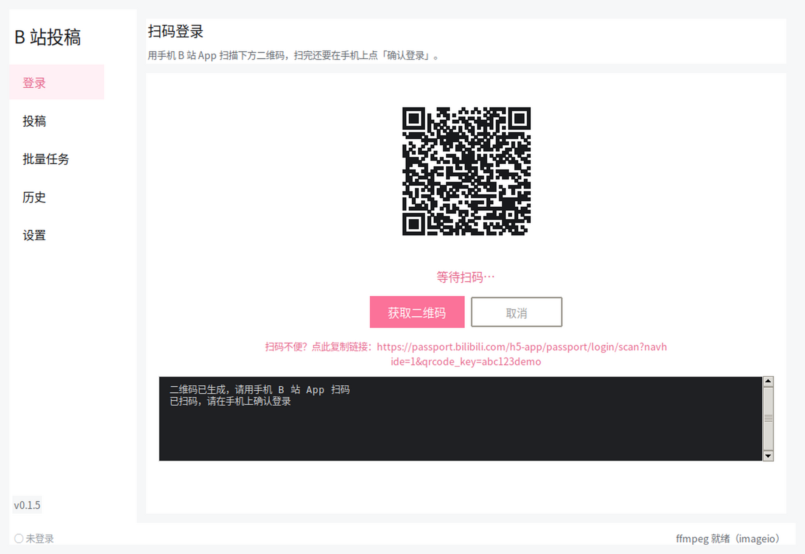
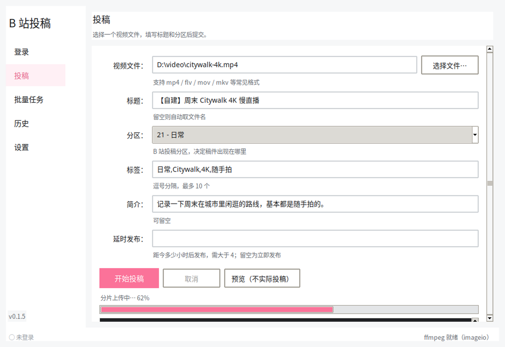
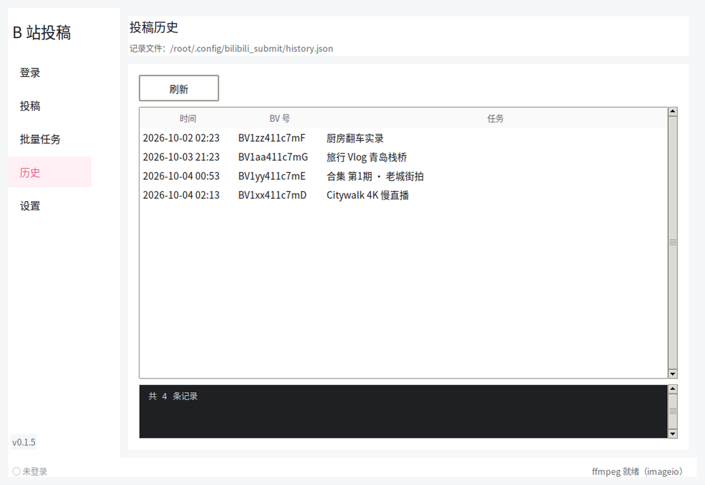
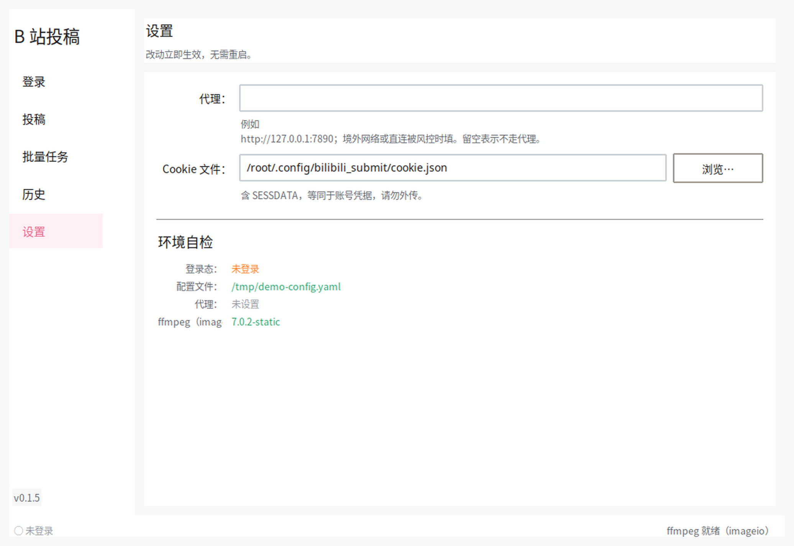
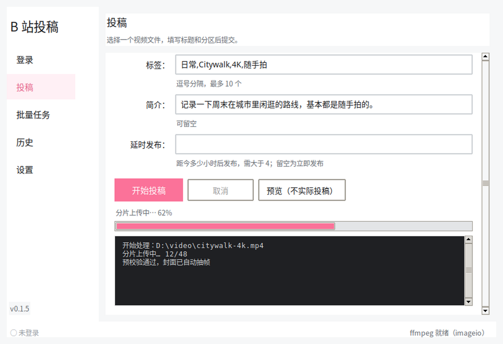

# 哔哩哔哩自动投稿程序

扫码登录一次，之后按配置文件把本地视频批量投到 B 站，返回 BV 号。

自研实现，直接调用 B 站创作中心 Web 接口——不依赖 biliup 等第三方二进制，不需要申请开放平台资质，也不受第三方库更新的影响。

```
bilibili-submit upload 视频.mp4 --title "标题" --tid 21 --tag "标签,日常"
```

## 文档

| 文档 | 内容 |
|---|---|
| **本文** | 快速上手、命令、配置说明、发布方式 |
| [更新日志](CHANGELOG.md) | 每个版本的增删改，升级前先看一眼 |
| [部署指南](docs/DEPLOY.md) | 源码部署：三平台安装、代理、ffmpeg、定时任务、后台运行 |
| [常见问题](docs/FAQ.md) | 按症状排查：错误码、二维码、上传慢、杀软误报、配置报错 |
| [架构说明](docs/ARCHITECTURE.md) | 分层与依赖方向、关键设计决策、如何加新命令 |

## 下载

Releases 里的资产是**公开直链**，任何人点开即下，无需登录：

**图形界面版**（不想用命令行就下这个）：

| 资产 | 体积 | ffmpeg | 说明 |
|---|---|---|---|
| [`bilibili-submit-gui.exe`](https://github.com/llovepeaches/bilibili-submit/releases/download/v0.1.4/bilibili-submit-gui.exe) | ~72 MB | 内置 | **双击开窗口**，扫码登录 + 表单投稿，不用管 ffmpeg 放哪 |

**命令行版**：

| 资产 | 体积 | ffmpeg | 说明 |
|---|---|---|---|
| [`bilibili-submit-standalone.exe`](https://github.com/llovepeaches/bilibili-submit/releases/download/v0.1.4/bilibili-submit-standalone.exe) | ~69 MB | 内置 | **单个 exe，双击即用**，不用管 ffmpeg 放哪 |
| [`bilibili-submit.exe`](https://github.com/llovepeaches/bilibili-submit/releases/download/v0.1.4/bilibili-submit.exe) | ~10 MB | 需自备 | 轻量 exe |
| [`bilibili-submit-full-windows.zip`](https://github.com/llovepeaches/bilibili-submit/releases/download/v0.1.4/bilibili-submit-full-windows.zip) | ~40 MB | 外置 | 轻量 exe + `ffmpeg.exe`，启动最快 |
| [`bilibili-submit-mini-windows.zip`](https://github.com/llovepeaches/bilibili-submit/releases/download/v0.1.4/bilibili-submit-mini-windows.zip) | ~10 MB | 需自备 | 轻量 exe + config + 文档 |

命令行版怎么选：只想双击就用、不想管 ffmpeg → `standalone`；
在意体积和启动速度 → `full`，把 `ffmpeg.exe` 和 exe 放一起就行。

> GUI 版内置了 ffmpeg，是为了「下载下来双击就能用」——用窗口界面的人
> 通常不会自己去装 ffmpeg。嫌大的话可以用 `full` 包里的命令行版，
> 或者看下面的「内置 ffmpeg 的代价」。

两种界面**共用同一套业务逻辑**，可以混着用：GUI 里填的表单和
命令行 `upload` 的参数一一对应，cookie 也是同一份。

目标机器**不需要装 Python**。

> **找不到 exe？** 别下页面顶部的 `Source code (zip)`——那是**源码**，里面只有 `.py` 文件。
> 打包好的 `.exe` 在右侧的 **Releases → Assets** 里，链接见上表。

### 内置 ffmpeg 的代价

`gui` 和 `standalone` 都把 ffmpeg 塞进了 exe 归档，换来"一个文件走天下"，代价是两条：

- **体积**：约 10~13 MB → 约 69~72 MB（exe 归档有压缩；启动解压后约占 94 MB）。
- **启动**：单文件版每次启动都要把 ffmpeg 解压到临时目录，启动变慢；
  临时目录里的 exe 也更容易被杀毒软件误判。

ffmpeg 只影响 `cover: auto` 自动抽帧，**不影响投稿本身**。
不需要自动封面的话，命令行轻量版（10 MB）完全够用。

## 快速开始

### 图形界面版（推荐新用户）

双击 `bilibili-submit-gui.exe`，五个页签走完流程：

| 页签 | 做什么 |
|---|---|
| **登录** | 点「获取二维码」→ 手机 B 站 App 扫 → **在手机上点「确认登录」**。二维码直接画在窗口里，扫不了可以点链接复制到剪贴板 |
| **投稿** | 选文件 → 填标题/分区/标签/简介 → 「开始投稿」。有「预览」按钮可以先空跑一遍验证参数 |
| **批量任务** | 加载 `config.yaml`，列表展示所有待投稿任务，逐条更新状态并带总进度 |
| **历史** | 看本机投过的稿（BV 号、时间） |
| **设置** | 配代理、换 cookie 路径，并做一次环境自检（登录态 / ffmpeg / 代理） |

窗口底部常驻状态栏，随时能看到**是否已登录**和 **ffmpeg 是否就绪**。
GUI 版内置了 ffmpeg，所以状态栏应该显示「ffmpeg 就绪（exe 内嵌）」——
说明 `cover: auto` 自动抽帧可直接用，不需要另外配置。

界面上的操作都是后台线程跑的，窗口不会卡住；登录和投稿都能随时「取消」。

<details>
<summary><b>界面截图</b>（点击展开）</summary>

登录（扫码）：



投稿（表单 + 进度）：



批量任务：


历史与设置：





窗口压到最小（880x600）时内容可滚动，按钮不会点不到：



</details>

### 命令行版

Windows 用户解压后：

```powershell
# 1. 扫码登录（用手机 B 站 App 扫，扫完必须在手机上点「确认登录」）
bilibili-submit.exe login

# 2. 投一个视频
bilibili-submit.exe upload demo.mp4 --title "我的第一个视频" --tid 21 --tag "测试,日常"

# 3. 批量投稿：先复制配置再改
copy config\config.example.yaml config\my.yaml
bilibili-submit.exe submit -c config\my.yaml --dry-run   # 先预览，确认无误再去掉 --dry-run
bilibili-submit.exe submit -c config\my.yaml
```

> 示例配置里有两个演示任务（单文件 + 批量目录），路径都是占位值。
> 直接跑会报「目录不存在」——把 `tasks` 换成你自己的路径，或删掉不用的那个。

源码运行把上面的 `bilibili-submit.exe` 换成 `python run.py` 即可。

Cookie 保存在 `~/.config/bilibili_submit/cookie.json`（权限 0600），有效期通常数月，过期后重新 `login`。

## 命令

| 命令 | 说明 |
|---|---|
| `login` | 扫码登录并保存 cookie。`--no-qr` 只显示链接、`--timeout N` 等待秒数、`--cookie-file` 换存储位置 |
| `upload <文件>` | 单文件投稿，命令行参数覆盖配置 |
| `submit -c <配置>` | 按配置文件批量/定时投稿，`--dry-run` 只预览不真跑 |
| `check [-c <配置>]` | 自检：配置、登录态、ffmpeg、分区 ID |
| `tid` | 列出常用分区 ID |
| `gui` | 启动图形界面（等价于双击 `bilibili-submit-gui.exe`） |
| `history` | 查看本机投稿历史 |

`upload` 常用参数：

```
--title --tid --tag --desc --cover --copyright --source
--dtime --dtime-offset --no-resume -c
```

投稿前建议先跑 `check`，它会一次性告诉你配置有没有问题、登录态是否有效、ffmpeg 是否就绪。

## 配置

完整示例见 [`config/config.example.yaml`](config/config.example.yaml)，几个容易踩的点：

- **定时发布**：`dtime`（绝对时间戳）或 `dtime_offset_hours`（相对小时数）二选一，**必须距今 4 小时以上**，否则直接报错。B 站不允许临近发布。
- **转载**：`copyright: 2` 时 `source` 必填，否则会被拒。
- **封面**：`cover: auto` 表示用 ffmpeg 抽视频首帧；给图片路径则直接上传；留 `null` 则不设封面。
- **批量任务**：`include`/`exclude` 通配符过滤，`title_template` 支持 `{stem}`（文件名主体）、`{name}`（完整文件名）、`{n}`（序号）。`per_task_interval_minutes` 控制每条之间的间隔，**批量投稿必调**，否则大概率撞 601 频控。

### 海外投稿 / 代理

服务器在境外时，除了走代理还要改上传线路，否则即使有代理也可能上传失败或极慢：

```yaml
# config/my.yaml
account:
  proxy: "http://127.0.0.1:7890"   # 登录和投稿都用这个

upload:
  line: auto                               # auto 自动择优，也可指定 bda2 / tx / estx
  profile: "ugcupos/bupfetch"              # 大陆用 ugcupos/bup，港澳台与海外用这个
```

**注意 `proxy` 属于 `account` 段，不是 `upload` 段。** 登录时也要走代理，
所以配置后登录用 `-c` 指定同一份文件：

```bash
bilibili-submit.exe login -c config\my.yaml
# 或临时指定，不写配置
bilibili-submit.exe login --proxy http://127.0.0.1:7890
```

优先级：`--proxy` > 配置的 `account.proxy` > 不走代理。

`concurrency` 是并发分片数，默认 3、上限 4。调高不会更快，反而更容易触发限流。

## 实现要点

投稿链路六步：线路探测 → 取上传凭证 → 分片上传 → 合并分片 → 封面上传 → 稿件投递。

几个容易踩的坑，代码里已经处理：

- **WBI 签名**：B 站 Web 接口的风控签名，缺失返回 `-352`。密钥每天轮换，从 `nav` 接口获取后按固定置换表派生 mixin_key，缓存并在被拒时自动刷新重放。
- **`filename` 不是本地文件名**：投稿接口要的 `videos[].filename` 实际是上传凭证里 `upos_uri` 的主体部分。写错会直接投稿失败。
- **`chunk_size` 由服务端给出**，不能硬编码。
- **末片长度是余数**，不是 `chunk_size`。
- **`preupload` 不走标准包装**：顶层直接是 `{"OK":1,"lines":[...]}`，没有 `code`/`data` 外壳，用通用解析器会误判。

风控处理策略：

| 错误码 | 含义 | 行为 |
|---|---|---|
| `601` | 投稿过快 | 阶梯退避重试（5/10/20/30/60 分钟 + 随机抖动），重试前刷新签名密钥 |
| `-352` | 签名失效 | 重新抓取密钥后重放一次 |
| `-101` | Cookie 过期 | 不重试，提示重新 `login` |
| `-412` | IP 风控 | 不重试，提示换网络 |
| `200009` | 当日投稿上限 | 不重试 |

投递后端在配置里切换（`submit.backend`）：默认 `web` 走 `add/v3`；万一它被下线，改 `web/v2` 走旧接口，或 `app`（需要 `access_key`，纯扫码登录拿不到）。后端是抽象过的，切换不用改代码。

## 自行打包

> 打包必须在 Windows 上进行。PyInstaller 官方明确说明它不是交叉编译器
> （"it is not a cross-compiler"），Nuitka、PyOxidizer 同样不支持——
> 在 Linux 或 macOS 上跑 `pyinstaller` **产不出** exe。

**方式一：Windows 本地打包（推荐）**

```
1. 装 Python 3.9+（务必勾选 Add Python to PATH）
2. 双击 build_windows.bat
```

脚本会自建虚拟环境、装依赖、执行打包，跑一次 `--version` 验证产物能启动，并自动把 ffmpeg 复制到 `dist\`。

**方式二：GitHub Actions 云端打包**

推 tag 即可，Actions 会在 Windows runner 上打包并发布 Release。仓库自带 `build-windows.yml`（日常构建）和 `release.yml`（发版），两者都带冒烟测试，**打包失败会直接标红而不是给你一个坏 exe**。

```bash
git tag v0.1.2 && git push origin v0.1.2   # 版本号换成你要发的
```

发布新版本也可以双击 `publish.bat`，它会自动建公开仓库、推送、打 tag 并打印下载链接。

### 打包相关的说明

- **轻量 exe 约 10 MB**，spec 已排除 tkinter/numpy/pandas/PIL 等用不到的大依赖。
- **ffmpeg 两种带法**，靠环境变量切换，同一份 spec 出两个 exe：

  | 打包命令 | 产物 | 大小 | ffmpeg |
  |---|---|---|---|
  | 默认 | `bilibili-submit.exe` | ~10 MB | 外置，`dist/ffmpeg.exe` |
  | `BUNDLE_FFMPEG=1 EXE_NAME=<名字>` | 自定名 exe | ~69 MB | 内嵌进归档 |

  内嵌的 ffmpeg 会出现在 `sys._MEIPASS` 下；每次启动都要解压到临时目录——
  启动变慢，且临时目录里的 exe 更容易被杀软拦截。要追求启动速度就用外置。
- 随包分发的是 `imageio-ffmpeg` 的静态版（~85 MB，已含 libx264），够抽帧和转码用。
  真要完整版，自行下载后覆盖 `dist/ffmpeg.exe`（外置）或 `vendor/ffmpeg.exe`（内嵌源）。
- 不想带 ffmpeg？删掉 `dist/ffmpeg.exe` 即可，除 `cover: auto` 外功能不受影响。
- **ffmpeg 定位顺序**：程序同目录 → exe 内嵌 → `imageio-ffmpeg` → 系统 `PATH`。
  放在程序旁边的优先，方便自行换版本。用 `check` 命令可随时查看当前命中哪一个。
- **控制台编码**：Windows 控制台默认 GBK，遇到中文和二维码用的方块字符会崩。程序启动时自动切 UTF-8，并探测终端是否支持方块字符，不支持时降级为只显示登录链接而不是抛异常。**建议用 Windows Terminal**；传统 cmd 里二维码显示成乱码时，复制链接到手机打开同样能登录。
- **杀软误报**：PyInstaller 的 bootloader 是恶意软件常用包装，启发式引擎容易误报。spec 已关闭 UPX 压缩降低误报率，自己用的话建议在 Windows Defender 里加白名单。

## 已知边界

**Windows exe 与真实投稿**由用户在自己机器上验证：开发环境没有真实账号 cookie，投递这一步无法端到端跑通。已实测的部分包括 WBI 签名算法（对照官方示例密钥，结果一致且被服务端接受）、二维码登录全流程、线路探测、`add/v3` 接口可达性、分片边界算法、断点续传状态管理、ffmpeg 定位与封面抽帧端到端（真实生成测试视频并抽出 JPEG），以及打包链路（spec 语法、依赖分析、打包后 HTTPS 与 CA 证书链可用、图标注入、Windows 控制台编码适配）。

单元测试 68 项（`python -m pytest`）。

**建议第一次拿一个几十 MB 的小视频试跑**，确认「登录 → 上传 → 拿到 BV 号」整条通了再批量用。

## 注意事项

- 新号、小号投稿频控明显更严，批量投稿务必设置 `per_task_interval_minutes`。
- 非正式会员单日投稿有数量上限（`200009`），可在主站答题转正式会员解除。
- **Cookie 等价于账号凭据**，别提交到仓库或外传。
- 本程序仅供管理自己的账号投稿使用。请勿用于批量注册、刷量或搬运他人作品——高频自动化会触发风控甚至封号。内置的保守退避策略正是为此。

## 项目结构

```
bilibili_submit/
├── wbi.py          WBI 签名
├── auth.py         扫码登录与 cookie 持久化
├── client.py       HTTP 会话、CSRF、响应归一化
├── console.py      Windows 控制台 UTF-8 适配
├── ffmpeg.py       ffmpeg 定位（外置 → 内嵌 → imageio → PATH）
├── lines.py        线路探测与择优
├── upload.py       分片上传、断点续传
├── cover.py        封面上传与抽帧
├── metadata.py     标题/标签/分区校验与 payload 组装
├── submit.py       稿件投递（web / app 后端 + 601 退避）
├── exceptions.py   异常体系与错误码映射
├── config.py       配置加载与校验
├── scheduler.py    任务执行与历史记录
└── cli.py          命令行入口

main.py                PyInstaller 打包入口
run.py                 源码运行入口
bili_submit.spec       打包配置
build_windows.bat      Windows 一键打包
publish.bat            一键发布并生成下载链接
assets/                图标与 Windows 版本资源
CHANGELOG.md           更新日志
tools/make_icon.py         图标生成（仅开发时用）
tools/setup_ffmpeg.py      复制 ffmpeg 到指定目录（--dest vendor 供内嵌打包）
tools/make_source_zip.py   打包源码 zip
```

依赖方向单向：`wbi`/`auth` → `client` → `upload`/`cover`/`submit` → `config`/`scheduler`/`cli`，任一层可独立替换。
