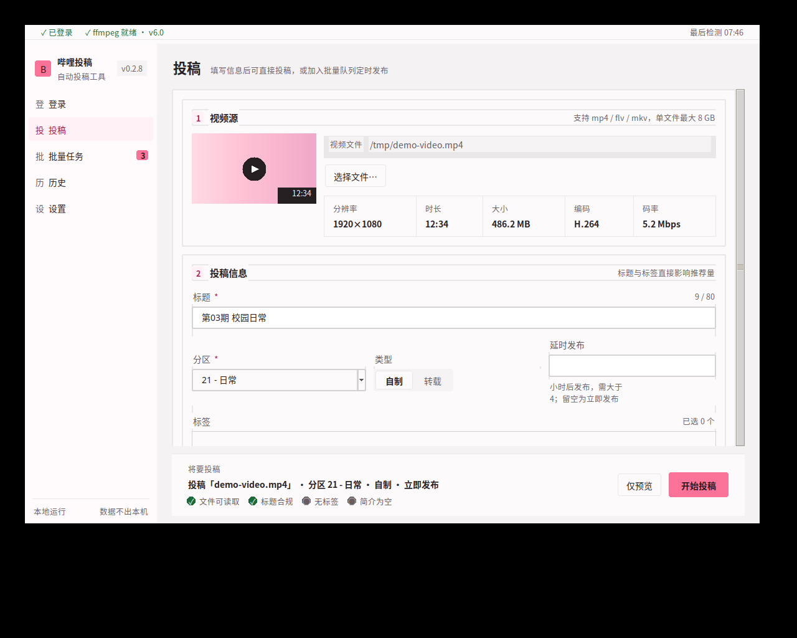
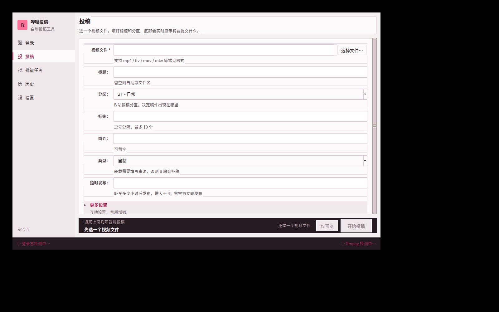
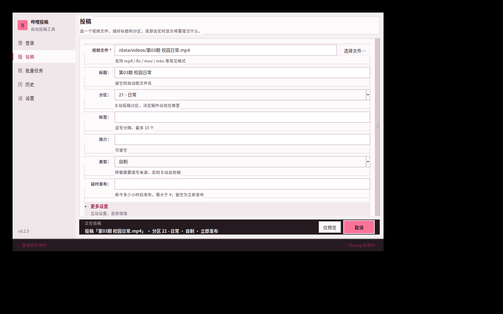
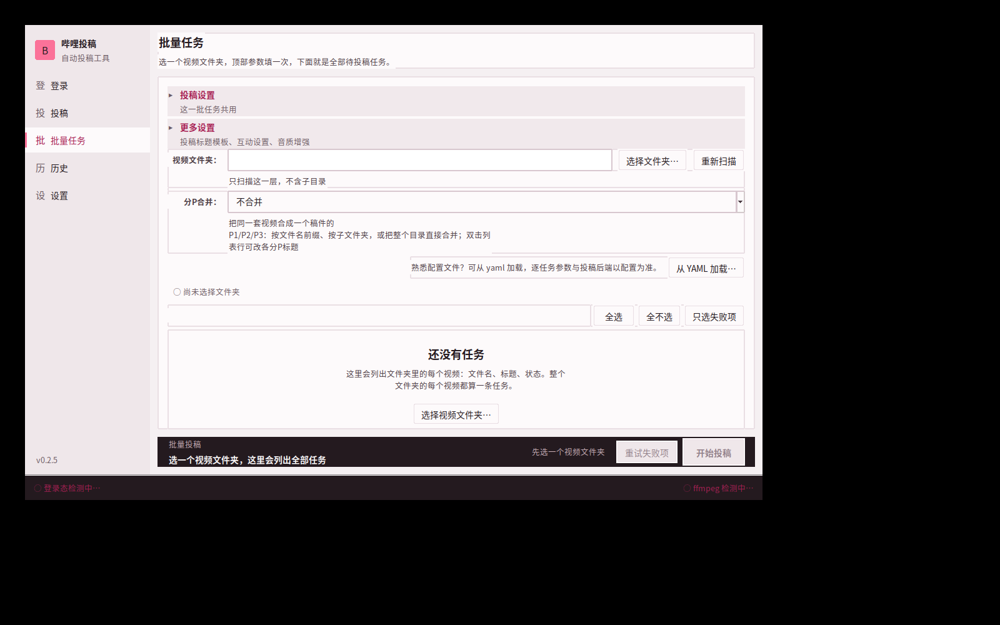
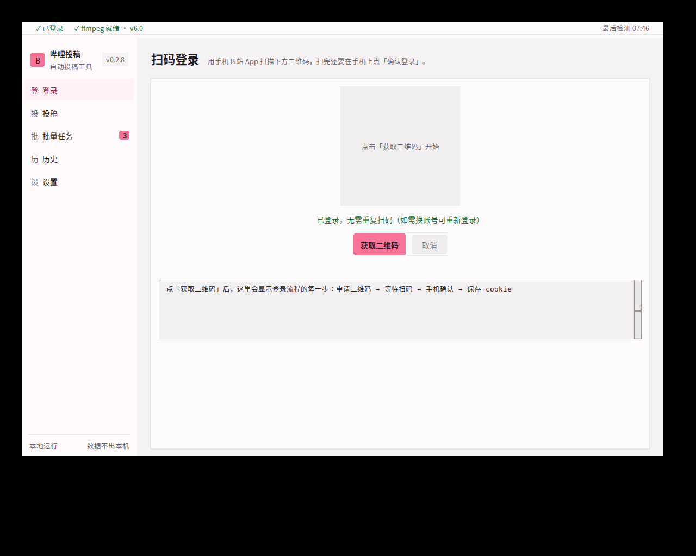
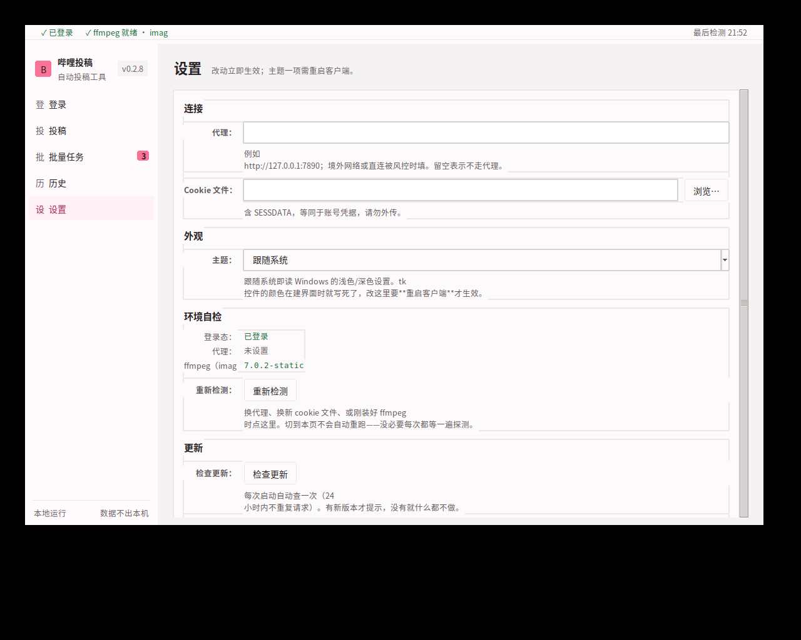
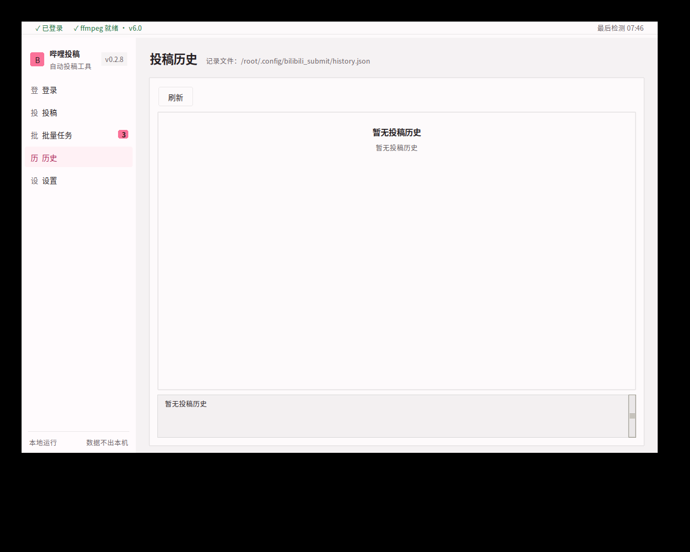
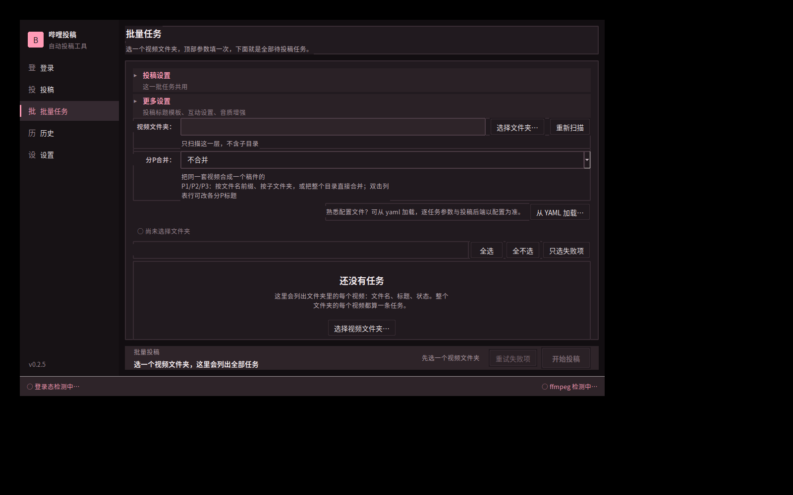
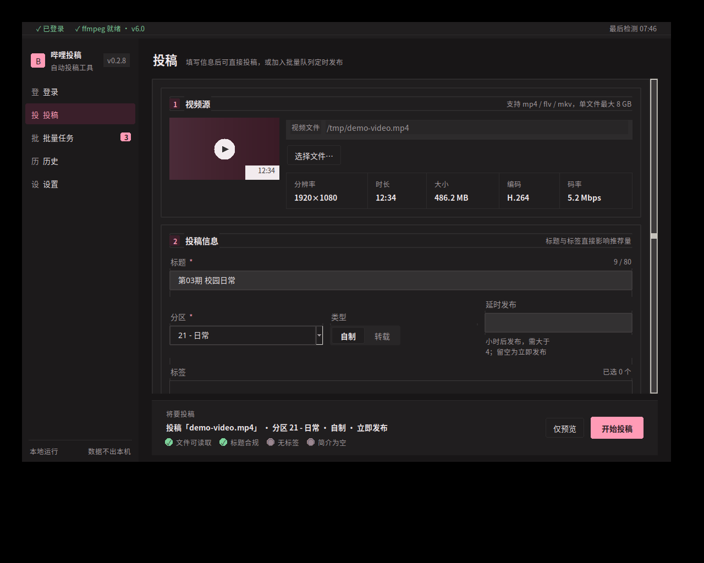
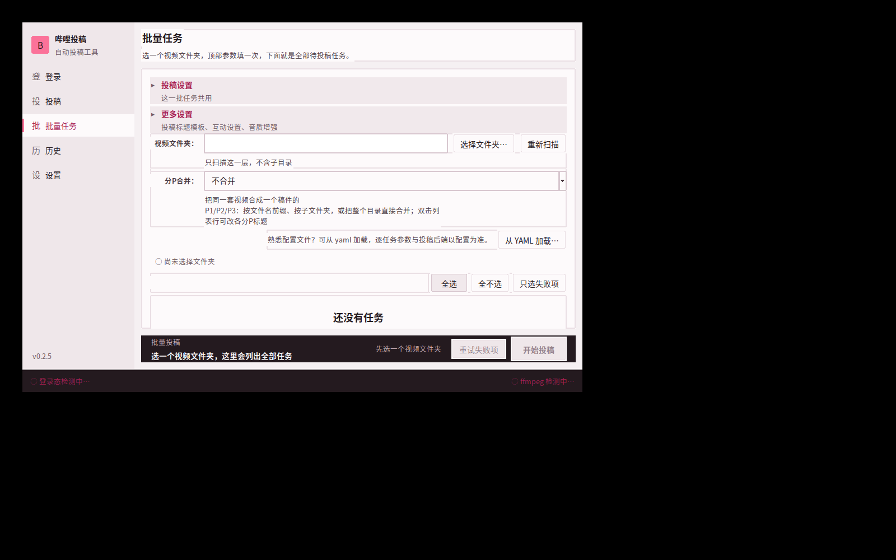

# 哔哩哔哩自动投稿程序

把本地视频投到自己的 B 站账号上，**不用打开 B 站网页、也不用手动填投稿表单**。

扫码登录一次，之后就两件事：

- **单个视频**——点「选择文件…」，填个标题、选个分区，点「开始投稿」；
- **一批视频**——点「选择文件夹…」选中装着视频的目录，顶部填一次分区和标签，
  下面自动列出全部待投稿的任务，勾几个就能跑。**不用写配置文件。**同一套
  视频还能合并成**一个稿件的多个分P**（见下文）；

跑完给你一串 BV 号。失败了会告诉你**哪一条、因为什么**，不用自己猜。

```
bilibili-submit upload 视频.mp4 --title "标题" --tid 21 --tag "标签,日常"
```

两种用法：图形界面（点几下就行）或命令行。

## 文档

| 文档 | 内容 |
|---|---|
| **本文** | 快速上手、命令、配置说明、发布方式 |
| [更新日志](CHANGELOG.md) | 每个版本的增删改，升级前先看一眼 |
| [部署指南](docs/DEPLOY.md) | 源码部署：三平台安装、代理、ffmpeg、定时任务、后台运行 |
| [常见问题](docs/FAQ.md) | 按症状排查：错误码、二维码、上传慢、杀软误报、配置报错 |
| [架构说明](docs/ARCHITECTURE.md) | 分层与依赖方向、关键设计决策、如何加新命令 |

## 下载

**图形界面版**（不想用命令行就下这个）：

| 资产 | 体积 | 安装 | 说明 |
|---|---|---|---|
| [`bilibili-submit-setup.exe`](https://github.com/llovepeaches/bilibili-submit/releases/download/v0.2.7-rc.1/bilibili-submit-setup.exe) | ~33 MB | 需要 | **推荐**。双击安装，开始菜单有入口，能干净卸载 |
| [`bilibili-submit-gui-portable.exe`](https://github.com/llovepeaches/bilibili-submit/releases/download/v0.2.7-rc.1/bilibili-submit-gui-portable.exe) | ~72 MB | 免安装 | 单文件便携版，拷走即用 |

两种都是「双击开窗口」，扫码登录 + 表单投稿，**不用管 ffmpeg 放哪**。
区别只在打包方式：

| | 安装版（setup） | 便携版（portable） |
|---|---|---|
| 安装 | 标准安装向导，可选装到用户目录 | 不用装 |
| 启动速度 | **快**（不解压） | 较慢（每次把 ffmpeg 解压到临时目录） |
| 快捷方式 | 开始菜单，可选桌面 | 无 |
| 升级 | 重跑安装包即可 | 重新下载替换 |
| 卸载 | 「设置 → 应用」里能卸 | 直接删文件 |
| 适合 | 自己的电脑长期用 | 临时用、U 盘、别人的机器 |

> 安装版启动快，是因为它把程序打成**目录**（ffmpeg 放在程序旁边），
> 而不是把 ffmpeg 塞进 exe —— 后者每次启动都要解压 60 MB 到临时目录。
> 顺带好处：ffmpeg 放在程序目录里，你想换版本直接替换那个文件即可。

**命令行版**：

| 资产 | 体积 | ffmpeg | 说明 |
|---|---|---|---|
| [`bilibili-submit-standalone.exe`](https://github.com/llovepeaches/bilibili-submit/releases/download/v0.2.7-rc.1/bilibili-submit-standalone.exe) | ~70 MB | 内置 | **单个 exe，双击即用**，不用管 ffmpeg 放哪 |
| [`bilibili-submit.exe`](https://github.com/llovepeaches/bilibili-submit/releases/download/v0.2.7-rc.1/bilibili-submit.exe) | ~10 MB | 需自备 | 轻量 exe |
| [`bilibili-submit-full-windows.zip`](https://github.com/llovepeaches/bilibili-submit/releases/download/v0.2.7-rc.1/bilibili-submit-full-windows.zip) | ~41 MB | 外置 | 轻量 exe + `ffmpeg.exe`，启动最快 |
| [`bilibili-submit-mini-windows.zip`](https://github.com/llovepeaches/bilibili-submit/releases/download/v0.2.7-rc.1/bilibili-submit-mini-windows.zip) | ~10 MB | 需自备 | 轻量 exe + config + 文档 |

命令行版怎么选：只想双击就用、不想管 ffmpeg → `standalone`；
在意体积和启动速度 → `full`，把 `ffmpeg.exe` 和 exe 放一起就行。

两种界面**共用同一套业务逻辑**，可以混着用：GUI 里填的表单和
命令行 `upload` 的参数一一对应，cookie 也是同一份。

目标机器**不需要装 Python**。

### 用户数据存在哪

登录状态、界面偏好、投稿历史都放在**用户目录下**，不在程序目录：

```
%USERPROFILE%\.config\bilibili_submit\
├── cookie.json       登录状态
├── ui-state.json     界面偏好（上次用的目录等）
└── history.json      投稿历史
```

所以**卸载不会删掉这些** —— 重装后不用重新扫码。卸载只清理程序目录
本身（`C:\Program Files\bilibili-submit\`）。想彻底清干净，连这个
`.config` 目录一起删即可。

### 内置 ffmpeg 的代价

`portable` 和 `standalone` 把 ffmpeg 塞进了 exe 归档，换来「一个文件走天下」，代价是两条：

- **体积**：约 10~13 MB → 约 69~72 MB（exe 归档有压缩；启动解压后约占 94 MB）。
- **启动**：单文件版每次启动都要把 ffmpeg 解压到临时目录，启动变慢；
  临时目录里的 exe 也更容易被杀毒软件误判。

**安装版没有这个问题** —— 它是目录版，ffmpeg 就在程序旁边，
启动即用。安装包本身小（~33 MB）也是因为 ffmpeg 在安装时单独压缩。

ffmpeg 只影响 `cover: auto` 自动抽帧，**不影响投稿本身**。
不需要自动封面的话，命令行轻量版（10 MB）完全够用。

## 快速开始

### 图形界面版

双击 `bilibili-submit-gui.exe`，五个页签走完流程：

| 页签 | 做什么 |
|---|---|
| **登录** | 点「获取二维码」→ 手机 B 站 App 扫 → **在手机上点「确认登录」**。二维码直接画在窗口里，扫不了可以点链接复制到剪贴板 |
| **投稿** | 选文件 → 填标题/分区/标签/简介/**类型** → 「开始投稿」。有「预览」按钮可以先空跑一遍验证参数 |
| **批量任务** | **点「选择文件夹…」自动扫描目录里的视频，不用写配置文件**。顶部填一次分区/类型/标签/简介/延时，这一批共用。可勾选要跑哪几条，执行前先检查文件是否存在。跑的过程中每行实时变色（成功绿 / 失败红 / 进行中粉 / 缺失橙），失败的可以一键只重试失败项。互动设置、音质开关和投稿标题模板收在**「更多设置」折叠区**里（默认收起，收起时标题栏会列出已开启了哪几项）。下次打开自动恢复上次的目录和参数 |
| **历史** | 看本机投过的稿（BV 号、时间） |
| **设置** | 配代理、换 cookie 路径，并做一次环境自检（登录态 / ffmpeg / 代理） |

窗口底部常驻状态栏，随时能看到**是否已登录**和 **ffmpeg 是否就绪**；
批量任务执行时中段还会显示进度，切到别的页也看得见。
GUI 版内置了 ffmpeg，所以状态栏应该显示「ffmpeg 就绪（exe 内嵌）」——
说明 `cover: auto` 自动抽帧可直接用，不需要另外配置。

所有耗时操作都在后台线程跑，窗口不会卡住；登录和投稿都能随时「取消」。

### 多分 P 投稿

一套视频可以合成**一个稿件的 P1/P2/P3**（一个 BV 号，播放器里连续切换），
而不是每个视频各占一个 BV 号。三种分法，在批量任务页的「分P合并」里选：

**按文件名前缀分组**（看文件名猜）

```
旅行_01.mp4  ┐
旅行_02.mp4  ├→ 一个稿件「旅行」，3 个分P
旅行_03.mp4  ┘
教程.mp4     ──→ 单独一个稿件（没有同伴，不合并）
```

只认**文件名尾部**的序号：`旅行_01`/`旅行-2`/`第3集`/`P4`/`旅行_01_1080p`
都能认出来。文件名里没有别的线索时（比如 `01.mp4`、`第3集.mp4`）要求序号
**从 1 开始且连续**才敢合并——否则 `2023.mp4` 和 `2024.mp4` 会被误当成一套。

**按文件夹分组**（看目录结构，更省心）

```
视频/
├─ 旅行/
│  ├─ a.mp4  ┐
│  ├─ b.mp4  ├→ 一个稿件「旅行」，3 个分P
│  └─ c.mp4  ┘
├─ 教程/
│  └─ x.mp4  ──→ 一个稿件「教程」（只有一个视频，就是单 P）
└─ solo.mp4  ──→ 单独一个稿件（根目录散落的文件不合并）
```

文件夹名就是稿件标题——那通常是你自己起的名字，比 `output.mp4` 像样。
只往下钻**一层**子目录，不会因为你指到「视频」这种大目录就一次冒出几百个
稿件。根目录第一层散落的视频**不合并**：它们没被放进任何子文件夹，
说明你没把它们当成一套。

**整个目录合并**（最简单，直接按当前文件夹合并）

```
视频/
├─ a.mp4  ┐
├─ b.mp4  ├→ 一个稿件「视频」，3 个分P
└─ c.mp4  ┘
```

适合已经把一套视频整整齐齐放在一个文件夹里的场景，不用额外建子文件夹。

标题**默认就是文件名/文件夹名**，双击列表行可以改：弹出的对话框上面是
**稿件标题**（播放器里显示的那行字），下面是各分 P 标题（多 P 时才有）。
单 P 任务也能改——之前双击它没反应，想改标题只能去改文件名，绕得太远。

列表里「任务」和「标题」是分开两列：任务名是标识，标题是投出去的名字。
两者默认一致，**改过之后就不一样了**，「我改过哪些」一眼可见。

双击一行改一条。要给一批任务统一起名，在「更多设置」里填**投稿标题模板**
再点「套用到选中行」——`{name}` 是文件名或文件夹名，`{n}` 是勾选顺序：

```text
{name} 第{n}集   →   旅行 第1集、旅行 第2集…
合集 - {name}    →   合集 - a、合集 - b…
```

只套用到**勾选的行**，没勾的一条都不动——列表里可能有一半已经手动改过标题。

自动分组猜错了也没关系，把开关切回「不合并」就恢复成原来一个视频一个稿件。

命令行同理。**给多个文件**或**给一个目录**都是多 P：

```bash
bili-submit upload 旅行_01.mp4 旅行_02.mp4 --title "旅行" \
  --part-title "出发" --part-title "路上" --tid 21

# 整个目录就是一套视频，不用把十几个文件名敲一遍
bili-submit upload D:/视频/旅行日记 --tid 21
```

不填 `--title` 时：给目录就取目录名，给文件就去掉尾部序号
（`旅行_01` → 「旅行」）。命令行一次只投一个稿件，所以目录只收第一层；
想要「每个子文件夹一个稿件」请用客户端或配置文件。

配置文件里用 `type: multip` + `files:`（见
[`config.example.yaml`](config/config.example.yaml) 的模式 C/D），
`part_titles` 可给每个分 P 单独命名；也可以直接给 `dir:`，
目录里的视频就是各分 P。batch 任务加 `group_by: folder`
则是**每个子文件夹出一个稿件**。

### 投稿类型：自制 / 转载

三个入口都能设（客户端 / 命令行 / 配置文件）。客户端在投稿页和批量任务页
的**「投稿设置」**区里选「类型」：

| 类型 | `copyright` | 还要填 |
|---|---|---|
| 自制 | `1`（默认） | — |
| 转载 | `2` | **`source`**：原视频链接或出处 |

选了「转载」才会出现「转载来源」输入框；选回「自制」它自己收起来。
**转载不填来源会被拒稿**（服务端返回 21004），所以客户端在点「开始投稿」
时就拦住，不会让你等一批任务逐个失败完才发现是同一个原因。

```bash
bili-submit upload a.mp4 --copyright 2 --source "https://www.bilibili.com/video/BV1xx"
```

```yaml
defaults:
  copyright: 2
  source: "https://www.bilibili.com/video/BV1xx"
```

> 转载来源记的是**出处**，不是你的稿件地址。填错不会报错，但审核会问。

### 投稿选项：互动设置与音质

三个入口都能设（客户端 / 命令行 / 配置文件）。客户端里收在投稿页和批量
任务页的**「更多设置」折叠区**，默认收起——收起时标题栏会列出已开启的项。

| 选项 | 配置项 | 命令行 | 说明 |
|---|---|---|---|
| 关闭弹幕 | `up_close_danmu` | `--close-danmu` | 关闭后不再有新的弹幕 |
| 关闭评论区 | `up_close_reply` | `--close-reply` | 关闭后不再有新的评论 |
| 精选评论 | `up_selection_reply` | `--selection-reply` | 只有精选的评论公开显示 |
| 杜比音效 | `dolby` | `--dolby` | **源文件本身得是杜比音轨**，否则开了也不会有效果 |
| Hi-Res 无损 | `hires` | `--hires` | 同上，需要无损音轨，接口字段名叫 `lossless_music` |

```yaml
defaults:
  dolby: 1
  hires: 0
  up_close_danmu: true
```

命令行上这些开关**只能开**：不传表示「听配置文件的」，不会因为没传参就把
配置里开着的项悄悄关掉。想关请改配置文件。

> **水印不在这个列表里。** B 站的水印是**账号级**设置（创作设置 →
> 原创视频添加水印），投稿接口不带这个参数，所以没法做成投稿时的开关。
> 要开得去 B 站网页端自己开，开了之后新建的稿件会按那个设置走。

> 登录只需要扫一次码，cookie 存本地，有效期通常数月。
>
> 批量任务页上次选的目录和顶部参数会记在
> `~/.config/bilibili_submit/ui-state.json`，下次打开自动回填并重新扫描。
> 这个文件里没有任何凭据，可以放心删。

<details>
<summary><b>界面截图</b>（点击展开）</summary>

投稿页。底部是**固定操作条**：左边实时显示「将要投什么」，条件没齐时
按钮就地灰掉并写明原因（不用滚回列表底部找按钮，也不用点了才知道错）：



条件没齐时——按钮灰，旁边写清楚差什么：



运行中主按钮就地变成「取消」，而不是一个点不动的「开始投稿」：



批量任务（勾选 + 文件预检 + 状态着色 + 状态字形）：



登录（扫码）与设置：





历史页：



深色主题。**不是浅色的反转**——卡片比底色亮，而操作条比卡片更亮，
用「更亮的表面」表达深度，从不用纯黑：





窗口压到最小（1000x660）时内容可滚动，**底部操作条始终可见**：



</details>

### 命令行版

Windows 用户解压后：

```powershell
# 1. 扫码登录（用手机 B 站 App 扫，扫完必须在手机上点「确认登录」）
bilibili-submit.exe login

# 2. 投一个视频
bilibili-submit.exe upload demo.mp4 --title "我的第一个视频" --tid 21 --tag "测试,日常"

# 3. 批量投稿：先复制配置再改
copy config\config.example.yaml config\my.yaml
bilibili-submit.exe submit -c config\my.yaml --dry-run   # 先预览，确认无误再去掉 --dry-run
bilibili-submit.exe submit -c config\my.yaml
```

> 示例配置里有两个演示任务（单文件 + 批量目录），路径都是占位值。
> 直接跑会报「目录不存在」——把 `tasks` 换成你自己的路径，或删掉不用的那个。
> 拿不准就先跑 `--dry-run`：只打印将要做什么，不真投。

源码运行把上面的 `bilibili-submit.exe` 换成 `python run.py` 即可。

## 命令

| 命令 | 说明 |
|---|---|
| `login` | 扫码登录并保存 cookie。`--no-qr` 只显示链接、`--timeout N` 等待秒数、`--cookie-file` 换存储位置 |
| `upload <文件或目录>…` | 投稿。**给多个文件或一个目录就合并成一个稿件的多个分P**（`--part-title` 逐个命名）；目录只收第一层 |
| `submit -c <配置>` | 按配置文件批量/定时投稿，`--dry-run` 只预览不真跑 |
| `check [-c <配置>]` | 自检：配置、登录态、ffmpeg、分区 ID |
| `tid` | 列出常用分区 ID |
| `gui` | 启动图形界面（等价于双击 `bilibili-submit-gui.exe`） |
| `history` | 查看本机投稿历史 |

`upload` 常用参数：

```
--title --tid --tag --desc --cover --copyright --source
--dtime --dtime-offset --part-title --no-resume -c
--dolby --hires --close-danmu --close-reply --selection-reply
```

投稿前建议先跑 `check`，它会一次性告诉你配置有没有问题、登录态是否有效、ffmpeg 是否就绪。

## 配置

完整示例见 [`config/config.example.yaml`](config/config.example.yaml)，几个容易踩的点：

- **定时发布**：`dtime`（绝对时间戳）或 `dtime_offset_hours`（相对小时数）二选一，**必须距今 4 小时以上**，否则直接报错。B 站不允许临近发布。
- **转载**：`copyright: 2` 时 `source` 必填，否则会被拒。
- **封面**：`cover: auto` 表示用 ffmpeg 抽视频首帧；给图片路径则直接上传；留 `null` 则不设封面。
- **批量任务**：`include`/`exclude` 通配符过滤，`title_template` 支持 `{stem}`（文件名主体）、`{name}`（完整文件名）、`{n}`（序号）。`per_task_interval_minutes` 控制每条之间的间隔，**批量投稿必调**，否则大概率撞 601 频控。
- **多分P**：`type: multip` + `files:`（数组顺序即 P1/P2/P3），`part_titles` 可选，给每个分P单独命名；不填就用文件名。也可以直接给 `dir:`，目录下所有视频就是各分P。一个 multip 任务只投一次稿。
- **按文件夹批量分P**：`type: batch` + `group_by: folder`，每个子文件夹出一个稿件（组内多个视频即多分P）；`group_by: prefix` 则按文件名前缀分。只扫一层子目录，根目录散落的文件各自独立。

### 海外投稿 / 代理

服务器在境外时，除了走代理还要改上传线路，否则即使有代理也可能上传失败或极慢：

```yaml
# config/my.yaml
account:
  proxy: "http://127.0.0.1:7890"   # 登录和投稿都用这个

upload:
  line: auto                               # auto 自动择优，也可指定 bda2 / tx / estx
  profile: "ugcupos/bupfetch"              # 大陆用 ugcupos/bup，港澳台与海外用这个
```

**注意 `proxy` 属于 `account` 段，不是 `upload` 段。** 登录时也要走代理，
所以配置后登录用 `-c` 指定同一份文件：

```bash
bilibili-submit.exe login -c config\my.yaml
# 或临时指定，不写配置
bilibili-submit.exe login --proxy http://127.0.0.1:7890
```

优先级：`--proxy` > 配置的 `account.proxy` > 不走代理。

`concurrency` 是并发分片数，默认 3、上限 4。调高不会更快，反而更容易触发限流。

## 实现要点

投稿链路六步：线路探测 → 取上传凭证 → 分片上传 → 合并分片 → 封面上传 → 稿件投递。

几个容易踩的坑，代码里已经处理：

- **WBI 签名**：B 站 Web 接口的风控签名，缺失返回 `-352`。密钥每天轮换，从 `nav` 接口获取后按固定置换表派生 mixin_key，缓存并在被拒时自动刷新重放。
- **`filename` 不是本地文件名**：投稿接口要的 `videos[].filename` 实际是上传凭证里 `upos_uri` 的主体部分。写错会直接投稿失败。
- **`chunk_size` 由服务端给出**，不能硬编码。
- **末片长度是余数**，不是 `chunk_size`。
- **`preupload` 不走标准包装**：顶层直接是 `{"OK":1,"lines":[...]}`，没有 `code`/`data` 外壳，用通用解析器会误判。

风控处理策略：

| 错误码 | 含义 | 行为 |
|---|---|---|
| `601` | 投稿过快 | 阶梯退避重试（5/10/20/30/60 分钟 + 随机抖动），重试前刷新签名密钥 |
| `-352` | 签名失效 | 重新抓取密钥后重放一次 |
| `-101` | Cookie 过期 | 不重试，提示重新 `login` |
| `-412` | IP 风控 | 不重试，提示换网络 |
| `200009` | 当日投稿上限 | 不重试 |

投递后端在配置里切换（`submit.backend`）：默认 `web` 走 `add/v3`；万一它被下线，改 `web/v2` 走旧接口，或 `app`（需要 `access_key`，纯扫码登录拿不到）。后端是抽象过的，切换不用改代码。

## 自行打包

> **只能在 Windows 上打包。** PyInstaller 官方明确说明它不是交叉编译器
> （"it is not a cross-compiler"），Nuitka、PyOxidizer 同样不支持——
> 在 Linux 或 macOS 上跑 `pyinstaller` **产不出** exe。

**方式一：Windows 本地打包**

```
1. 装 Python 3.9+（务必勾选 Add Python to PATH）
2. 双击 build_windows.bat
```

脚本会自建虚拟环境、装依赖、准备 ffmpeg、打包命令行版与图形界面版，
并对产物做结构校验（`_internal\` 缺了会直接报错——那会导致双击闪退）。
装了 [Inno Setup 6](https://jrsoftware.org/isinfo.php) 的话还会额外编译出
`dist\bilibili-submit-setup.exe`；没装就跳过，图形界面版目录照样可用。

**方式二：GitHub Actions 云端打包**

推 tag 即可，Actions 会在Windows runner 上打包并发 Release。仓库自带三个 workflow：

| workflow | 触发 | 干什么 |
|---|---|---|
| `build-windows.yml` | 推 main / PR | 命令行版快速构建 |
| `build-installer.yml` | 改了安装相关文件 | **验证安装器真能装上**（静默安装 → 启动 → 卸载全跑一遍） |
| `release.yml` | 推 tag | 出正式 Release，含安装器与全部资产 |

三者都带冒烟测试，**打包失败会直接标红，而不是给你一个坏 exe**。
安装器那一关尤其重要：只编译不安装的话，「装完双击闪退」这种问题
只能等用户遇到才知道。

```bash
git tag v0.2.7-rc.1 && git push origin v0.2.7-rc.1   # 版本号换成你要发的
```

版本号要同步改六处：`bilibili_submit/__init__.py`、`bili_submit.spec`、
`assets/version_info.txt`、`installer.iss`、`CHANGELOG.md` 的版本段，
以及本文件里的下载链接。前五处都有测试兜底
（`tests/test_spec_bundle.py`），改漏了会直接变红；下载链接没有测试，
发完记得点一下确认能下。
发布新版本也可以双击 `publish.bat`，它会把这几步一起做完。

### 两种打包形态

图形界面版有两种形态，由 `INSTALLER` 环境变量切换：

| | 便携版 | 安装版 |
|---|---|---|
| 环境变量 | 不设（`BUNDLE_FFMPEG=1 GUI=1`） | `INSTALLER=1 GUI=1` |
| PyInstaller 形态 | onefile 单文件 | **onedir 目录** |
| 产物 | `dist\bilibili-submit-gui-portable.exe` | `dist\bilibili-submit-gui\` + `dist\bilibili-submit-setup.exe` |
| ffmpeg | 打进 exe 归档 | **放在 exe 同目录**（构建脚本复制） |

安装版坚持用 onedir不是为了省事，是因为 onefile 每次启动都要把
内嵌的 60 MB ffmpeg 解压到 `%TEMP%` —— 装在 Program Files 下更慢、
更容易被杀软拦。onedir 把 ffmpeg 放程序旁边，既省掉解压，
用户也能自己替换 ffmpeg 版本（`ffmpeg.py` 本来就优先找这个位置）。

代价是「一个文件」变成「一个目录」，所以便携版仍然保留：U 盘、别人的
机器、「不想装东西」都是真实需求。

`INSTALLER=1` 与 `BUNDLE_FFMPEG=1` 同时给会**直接报错**——那等于
「既要目录版又要每次解压」，是个自相矛盾的组合，不如当场说清。

安装器脚本是 [`installer.iss`](installer.iss)（Inno Setup 6），
`tools/check_installer.py` 能在提交前静态检查它（段名拼错、
`#define` 未定义、缺 `recursesubdirs` 之类）。

### 打包相关的说明

- **轻量 exe 约 10 MB**，spec 已排除 tkinter/numpy/pandas/PIL 等用不到的大依赖。
- **ffmpeg 两种带法**，靠环境变量切换，同一份 spec 出两个 exe：

  | 打包命令 | 产物 | 大小 | ffmpeg |
  |---|---|---|---|
  | 默认 | `bilibili-submit.exe` | ~10 MB | 外置，`dist/ffmpeg.exe` |
  | `BUNDLE_FFMPEG=1 EXE_NAME=<名字>` | 自定名 exe | ~69 MB | 内嵌进归档 |

  内嵌的 ffmpeg 会出现在 `sys._MEIPASS` 下；每次启动都要解压到临时目录——
  启动变慢，且临时目录里的 exe 更容易被杀软拦截。要追求启动速度就用外置。
- 随包分发的是 `imageio-ffmpeg` 的静态版（~85 MB，已含 libx264），够抽帧和转码用。
  真要完整版，自行下载后覆盖 `dist/ffmpeg.exe`（外置）或 `vendor/ffmpeg.exe`（内嵌源）。
- 不想带 ffmpeg？删掉 `dist/ffmpeg.exe` 即可，除 `cover: auto` 外功能不受影响。
- **ffmpeg 定位顺序**：程序同目录 → exe 内嵌 → `imageio-ffmpeg` → 系统 `PATH`。
  放在程序旁边的优先，方便自行换版本。用 `check` 命令可随时查看当前命中哪一个。
- **控制台编码**：Windows 控制台默认 GBK，遇到中文和二维码用的方块字符会崩。程序启动时自动切 UTF-8，并探测终端是否支持方块字符，不支持时降级为只显示登录链接而不是抛异常。**建议用 Windows Terminal**；传统 cmd 里二维码显示成乱码时，复制链接到手机打开同样能登录。
- **杀软误报**：PyInstaller 的 bootloader 是恶意软件常用包装，启发式引擎容易误报。spec 已关闭 UPX 压缩降低误报率，自己用的话建议在 Windows Defender 里加白名单。

## 已知边界

**投稿投递这一步需要你自己的账号才能验证**——开发时没有真实 cookie，
所以「上传成功 → 拿到 BV 号」这一段没法自动跑通。其余环节都实测过：
WBI 签名算法、二维码登录全流程、线路探测、`add/v3` 接口可达性、
分片边界算法、断点续传、ffmpeg 定位与封面抽帧，以及打包链路本身。

单元测试 395 项（`python -m pytest`）。

**建议第一次拿一个几十 MB 的小视频试跑**，确认「登录 → 上传 → 拿到 BV 号」整条通了再批量用。

## 注意事项

- 新号、小号投稿频控明显更严，批量投稿务必设置 `per_task_interval_minutes`。
- 非正式会员单日投稿有数量上限（`200009`），可在主站答题转正式会员解除。
- **Cookie 等价于账号凭据**，别提交到仓库或外传。
- 仅供管理自己的账号投稿使用。请勿用于批量注册、刷量或搬运他人作品——
  高频自动化会触发风控甚至封号，程序内置的保守退避策略正是为此。

## 项目结构

```
bilibili_submit/
├── wbi.py          WBI 签名
├── auth.py         扫码登录与 cookie 持久化
├── client.py       HTTP 会话、CSRF、响应归一化
├── console.py      Windows 控制台 UTF-8 适配
├── ffmpeg.py       ffmpeg 定位（外置 → 内嵌 → imageio → PATH）
├── lines.py        线路探测与择优
├── upload.py       分片上传、断点续传
├── cover.py        封面上传与抽帧
├── metadata.py     标题/标签/分区校验与 payload 组装
├── submit.py       稿件投递（web / app 后端 + 601 退避）
├── exceptions.py   异常体系与错误码映射
├── config.py       配置加载与校验
├── scheduler.py    任务执行与历史记录
├── cli.py          命令行入口
└── ui/             图形界面（tkinter，不含业务逻辑）
    ├── app.py      主窗口：导航、状态栏
    ├── views/      登录 / 投稿 / 批量任务 / 历史 / 设置
    ├── widgets.py  可复用组件（FluentButton 自绘圆角按钮、ActionBar 底部操作条）
    ├── workers.py  后台线程与线程间消息
    ├── theme.py    语义色板、命名字体、间距（浅/深两套，见 .impeccable.md）
    ├── state.py    界面偏好（目录、参数、主题模式）
    ├── win_effects.py  Windows 11 系统效果（深色标题栏、窗口圆角）
    └── qr.py       二维码绘制（不依赖 Pillow）

main.py                PyInstaller 打包入口
main_gui.py            图形界面打包入口
run.py                 源码运行入口
bili_submit.spec       打包配置（INSTALLER=1 走 onedir，见「两种打包形态」）
installer.iss          Windows 安装器脚本（Inno Setup 6）
build_windows.bat      Windows 一键打包
publish.bat            一键发布
assets/                图标与 Windows 版本资源
CHANGELOG.md           更新日志
.impeccable.md界面设计上下文（改界面前先读）
docs/                  部署、FAQ、架构、截图
tests/test_theme_contrast.py  配色对比度与色相的守门测试
tests/test_action_bar.py      底部操作条的行为测试
tests/test_packaging.py       打包形态的约定测试（onedir / ffmpeg / 安装器）
tools/check_installer.pyinstaller.iss 静态检查（提交前跑）
tools/make_icon.py         图标生成（仅开发时用）
tools/setup_ffmpeg.py      复制 ffmpeg 到指定目录（--dest vendor 供内嵌打包）
tools/make_source_zip.py   打包源码 zip
```

依赖方向单向：`wbi`/`auth` → `client` → `upload`/`cover`/`submit` → `config`/`scheduler`/`cli`，任一层可独立替换。

`ui/` 只依赖业务层，业务层不反向依赖它——唯一的例外是 `cli.py` 里的
`gui` 命令会导入 `ui`（延迟导入，这样不带 tkinter 的环境也能用命令行）。
所以想换掉界面，只需重写 `ui/` 目录，业务层不用动。
